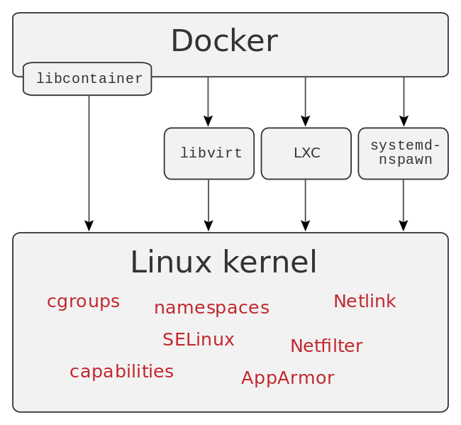
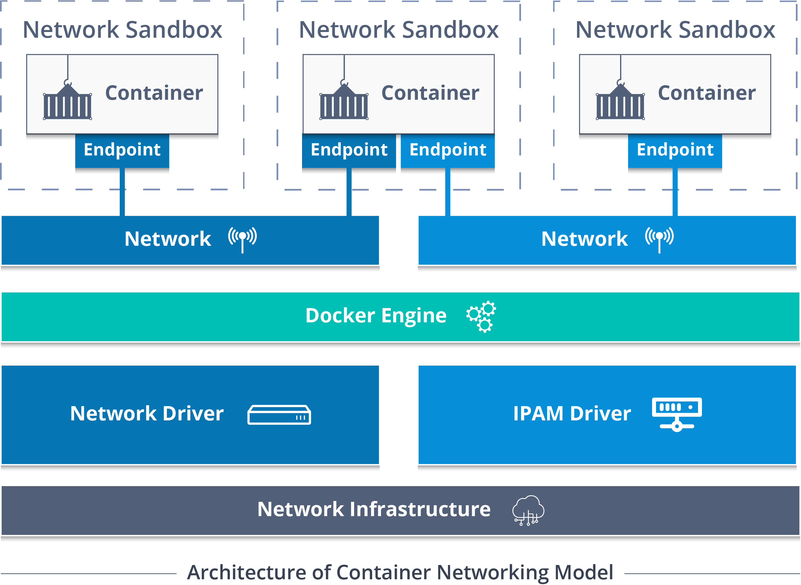

# Container vs VM

---

VMs are an infrastructure level construct to turn one machine into many servers

---

Containers are an app level construct

---

# Container

---

## What Is A Linux Container?

Each container will have its isolated user space and you can run multiple containers on a host, each having its own user space.

It means you can run different Linux systems (containers) on a single host.
For example, you can run an RHEL and a SUSE container on an Ubuntu server.
The Ubuntu Server can be a virtual machine or a physical host.

---

Containers are composed using multiple independent features

- namespaces
- cgroups
- security capabilities like seccomp, LSMs...
- and some filesystem magic

---

### Namespaces

- Namespaces define **groups of processes that share a common view regarding specific system resources.**
  Using these namespaces a container can have its own network interfaces, IP address etc.

- A process can be a member of multiple namespaces at once.

- When you run a container, Docker creates a **set of namespaces for that container** to provide a layer of isolation.

---

### Control groups

A control group (**cgroup**) is a Linux kernel feature that limits, accounts for, and isolates the resource usage (CPU, memory, disk I/O, network, and so on) of a collection of processes.

---

## What Is Docker ?

Docker is basically a container engine which uses the Linux Kernel features like namespaces and control groups to create containers on top of an operating system and automates application deployment on the container.

It provides a lightweight environment to run your application code.

Docker has an efficient workflow for moving your application from developers laptop, test environment to production.

---

**Docker Client** enables users to interact with Docker.

**The Docker host** provides a complete environment to execute and run applications. (Daemon, Images, Containers, Networks, and Storage.)

---

# Docker objects

---

## Images

- read-only binary template used to build containers.
- made up of filesystems layered over each other.
- Docker uses Copy-on-write union file system for its backend storage.
- Whenever changes are made to a container, only the changes will be written to disk using copy on write model.

---

**Containers** The image when it is 'running'.
The standard unit for app service.

---

**Networking** Docker implements networking in an application-driven manner and provides various options while maintaining enough abstraction for application developers.

---

## Storage

**Volumes** provide the ability to create persistent storage, with the ability to rename volumes, list volumes, and also list the container that is associated with the volume

---

**Docker registries** Stores, distributes and manages Docker images
