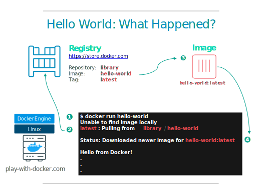

# Running your first container


```
docker run hello-world
```

That’s it: your first container. The hello-world container output tells you a bit about what just happened



If you would just download an image without running it directly use `pull` command.

```
docker pull alpine
```

You can use the `docker images` command to see a list of all images on your system.

Let's now run a Docker container based on this image and launch command `ls -l`in the docker.

```
docker run alpine ls -l
```

Try another command.

```
docker run alpine /bin/sh
```
Wait, nothing happened! Is that a bug? Well, no. 


These interactive shells will exit after running any scripted commands, unless they are run in an **interactive terminal** - so for this example to not exit, you need to use

```
docker run -it alpine /bin/sh
```

Options :
* `--interactive , -i`
* `--tty , -t`


And now try run a docker and assign it a name.
By default, Docker will run a command in the foreground. To run in the background, the option `-d` needs to be specified.

```
docker run -d --name test -it alpine
```

Ok, but how I can check if the docker run with the correct name?
Use `docker ps` command for list containers.

```
docker ps -a | grep test
```

Options :
* `--all , -a` (Show all containers (default shows just running))


The command `docker inspect <friendly-name|container-id>` provides more details about a running container, such as IP address.

The command `docker logs <friendly-name|container-id>` will display messages the container has written to standard error or standard out.

For stop the running container use `docker stop <friendly-name|container-id>` or `docker kill <friendly-name|container-id>` and for delete it `docker rm <friendly-name|container-id>` .


## Terminology
- *Images* - The file system and configuration of our application which are used to create containers. To find out more about a Docker image, run `docker inspect alpine`. In the demo above, you used the `docker pull` command to download the **alpine** image. When you executed the command `docker run hello-world`, it also did a `docker pull` behind the scenes to download the **hello-world** image.
- *Containers* - Running instances of Docker images &mdash; containers run the actual applications. A container includes an application and all of its dependencies. It shares the kernel with other containers, and runs as an isolated process in user space on the host OS. You created a container using `docker run` which you did using the alpine image that you downloaded. A list of running containers can be seen using the `docker ps` command.
- *Docker daemon* - The background service running on the host that manages building, running and distributing Docker containers.
- *Docker client* - The command line tool that allows the user to interact with the Docker daemon.
- *Docker Store* - A [registry](https://hub.docker.com/) of Docker images, where you can find trusted and enterprise ready containers, plugins, and Docker editions. You'll be using this later in this tutorial.
