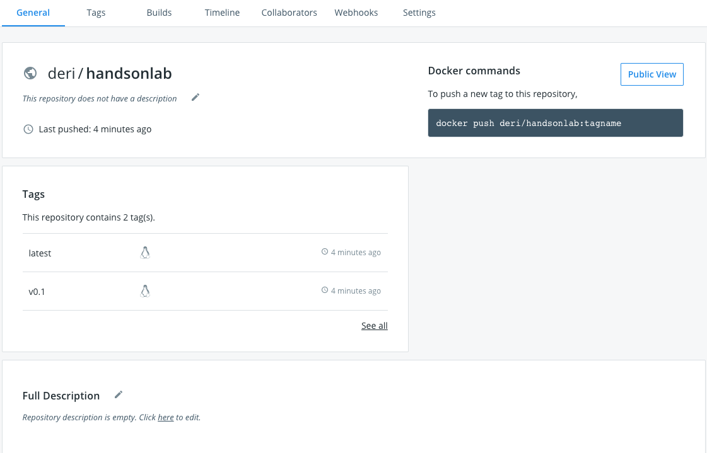

# Dockerfile
Instead of creating a static binary image, we can use a file called a Dockerfile to create an image.
The final result is essentially the same, but with a Dockerfile we are supplying the instructions for building the image, rather than just the raw binary files.
This is useful because it becomes much easier to manage changes, especially as your images get bigger and more complex.

For example, if a new version of figlet is released we would either have to re-create our image from scratch, or run our image and upgrade the installed version of figlet.
In contrast, a Dockerfile would include the `apt-get` commands we used to install figlet so that we - or anybody using the Dockerfile - could simply recompose the image using those instructions.


A Dozen Dockerfile Instructions
* FROM — specifies the base (parent) image.
* LABEL — provides metadata. Good place to include maintainer info.
* ENV — sets a persistent environment variable.
* RUN —runs a command and creates an image layer. Used to install packages into containers.
* COPY — copies files and directories to the container.
* ADD — copies files and directories to the container. Can upack local .tar files.
* CMD — provides a command and arguments for an executing container. Parameters can be overridden. There can be only one CMD.
* WORKDIR — sets the working directory for the instructions that follow.
* ARG — defines a variable to pass to Docker at build-time.
* ENTRYPOINT — provides command and arguments for an executing container. Arguments persist. 
* EXPOSE — exposes a port.
* VOLUME — creates a directory mount point to access and store persistent data.


## Define a container with Dockerfile

Create an empty directory on your local machine. Change directories (cd) into the new directory, create a file called Dockerfile, copy-and-paste the following content into that file, and save it. Take note of the comments that explain each statement in your new Dockerfile.

https://docs.docker.com/develop/develop-images/dockerfile_best-practices/

```bash
# Use an official Python runtime as a parent image
FROM python:2.7-slim

# Set the working directory to /app
WORKDIR /app

# Copy the current directory contents into the container at /app
COPY . /app

# Install any needed packages specified in requirements.txt
RUN pip install --trusted-host pypi.python.org -r requirements.txt

# Make port 80 available to the world outside this container
EXPOSE 80

# Define environment variable
ENV NAME HandsOnLab

# Run app.py when the container launches
CMD ["python", "app.py"]
```

This Dockerfile refers to a couple of files we haven’t created yet, namely `app.py` and `requirements.txt`. Let’s create those next.

Create two more files, `requirements.txt` and `app.py`, and put them in the same folder with the `Dockerfile`.
This completes our app, which as you can see is quite simple.
When the above Dockerfile is built into an image, app.py and requirements.txt is present because of that Dockerfile’s `COPY` command, and the output from app.py is accessible over HTTP thanks to the `EXPOSE` command.

[requirements.txt](02-example/requirements.txt)

[app.py](02-example/app.py)

Now we see that `pip install -r requirements.txt` installs the Flask and Redis libraries for Python, and the app prints the environment variable NAME, as well as the output of a call to socket.gethostname(). 
Finally, because Redis isn’t running (as we’ve only installed the Python library, and not Redis itself), we should expect that the attempt to use it here fails and produces the error message.

## Build the app
We are ready to build the app.
```
$ ls
Dockerfile		app.py			requirements.txt
```

For build the image you must use the command `docker build`.
Let’s build our first image out of this Dockerfile and name it handsonlab:v0.1

```
docker build -t handsonlab:v0.1 .
```

```
$ docker image ls
REPOSITORY                                       TAG                 IMAGE ID            CREATED             SIZE
handsonlab                                       v0.1                6262aafaa88a        30 seconds ago      131MB
```

We then start a container to check that our applications runs correctly:

```
docker container run  --name handsonlabexample -p 4000:80 handsonlab:v0.1
```


## Share your image
To demonstrate the portability of what we just created, let’s upload our built image and run it somewhere else.
After all, you need to know how to push to registries when you want to deploy containers to production.

A registry is a collection of repositories, and a repository is a collection of images—sort of like a GitHub repository, except the code is already built.
An account on a registry can create many repositories. The docker CLI uses Docker’s public registry by default.


> Note: We use Docker’s public registry here just because it’s free and pre-configured, but there are many public ones to choose from, and you can even set up your own private registry using Docker Trusted Registry.

If you don’t have a Docker account, sign up for one at hub.docker.com. Make note of your username.

Log in to the Docker public registry on your local machine.

```
$ docker login
```

### Tag the image
The notation for associating a local image with a repository on a registry is username/repository:tag. The tag is optional, but recommended.

For tag the running docker
```
docker tag <image> <username/repository:tag>
```

In the previus example we already set a tag but the name it's not the same.
We must specify to than this images is a remote image.

```
docker tag handsonlab:v0.1 deri/handsonlab:v0.1
```

To add the `latest` tag. 

```
docker tag handsonlab:v0.1  deri/handsonlab:latest
```

```
$ docker image ls | grep handsonlab
deri/handsonlab                                  latest              6262aafaa88a        30 minutes ago      131MB
deri/handsonlab                                  v0.1                6262aafaa88a        30 minutes ago      131MB
handsonlab                                       v0.1                6262aafaa88a        30 minutes ago      131MB
```

### Publish the image

Upload your tagged image to the repository:

```
docker push username/repository:tag
```



### Pull and run the image from the remote repository
From now on, you can use docker run and run your app on any machine with this command:

```
docker run -p 4000:80 username/repository:tag
```

If the image isn’t available locally on the machine, Docker pulls it from the repository.


