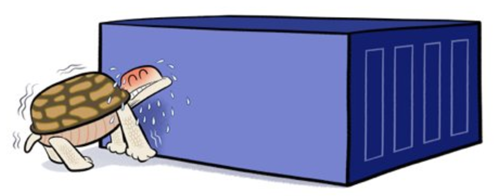

# Multi-stage builds

---

Sometimes Images feels heavy


base + code + dev tools + compiler + tests + build + ...

---

## Docker images and layers


- Adding more layers increase the image size
- Large images not only take time to build but also push and pull form a registry
- Smaller imges reduce build times and time to deploy
- Smaller images are more secure because the attacker surface is smaller

---

## Multi-stage builds


Multi-stage builds allow us to have multiple **stages**.

### Each stage is a **separate image, and can copy files from previous stages**.

---

## Multi stage vs builder pattern

- **Multi-stage builds**:
  Separate stages in a single Dockerfile

- **Build pattern**:
  Build with an CI tool, then copy artifacts over.

---


---

## Example nodejs

```Dockerfile
FROM node:12.13.0-alpine as build
WORKDIR /app
COPY package*.json ./
RUN npm install
COPY . .
RUN npm run build

FROM nginx
EXPOSE 3000
COPY ./nginx/default.conf /etc/nginx/conf.d/default.conf
COPY --from=build /app/build /usr/share/nginx/html
```

---

## Another example for .NET

--> `06-examples-compose/dotnet-minimal-web-api`

```Dockerfile
FROM mcr.microsoft.com/dotnet/sdk:6.0 AS build
WORKDIR /app
# Copy everything
COPY . .
# Restore as distinct layers
RUN dotnet restore
# Build and publish a release
RUN dotnet publish -c Release -o published-app

# Build runtime image
FROM mcr.microsoft.com/dotnet/aspnet:6.0 as runtime
WORKDIR /app
# Copy only the artifact from the build stage
COPY --from=build /app/published-app .
ENTRYPOINT ["dotnet", "NotesMinimalAPI.dll"]

```
